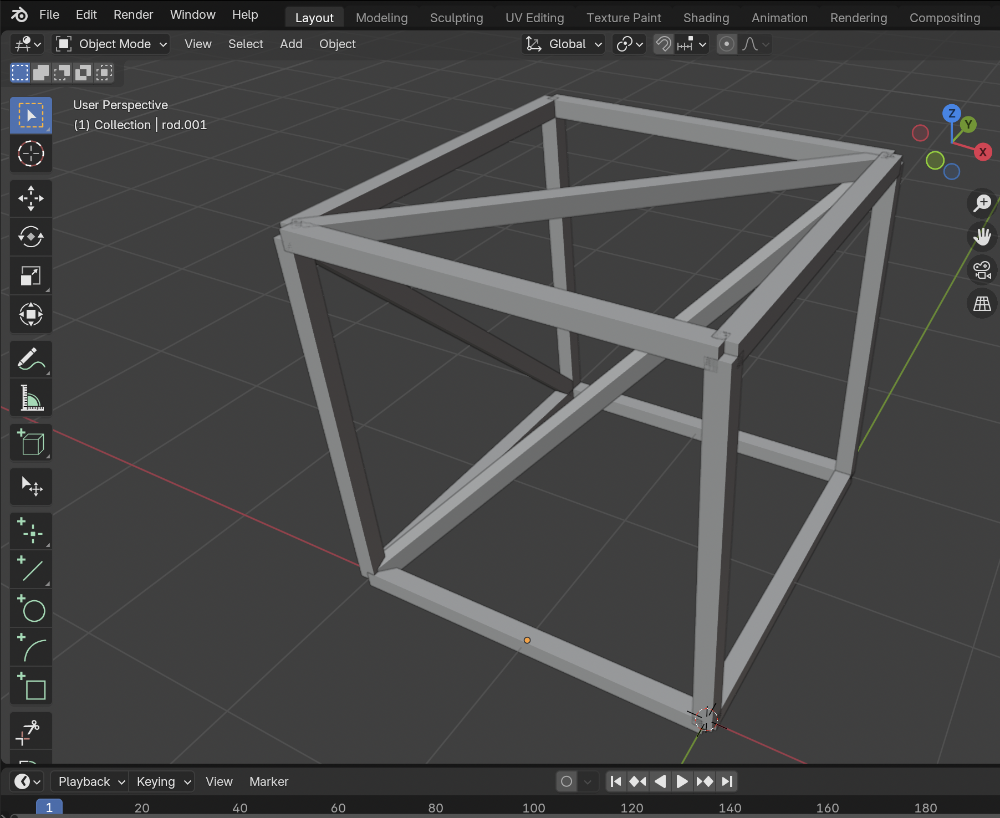

# Create GNN Edge Index

## About 
Reads an STL file and extracts the object connections or edge indices to a file. The file can be used in Graph Neural Networks

<p align="center">
  
</p>

## Instruction
Enter the file directories to be analyzed
- Open the ```run-getEdgeIndex.py``` file
- Change stlfiles_directory with the desired stl files path (the default will be the cad example)

Use the terminal to run the script
- Go to the blender location directory (in mac: /Applications/Blender.app/Contents/MacOS)
- Enter this line and it will run the blender script in the background
```./Blender --background --python /WhereYouSavedTheseFiles/run-getEdgeIndex.py```

